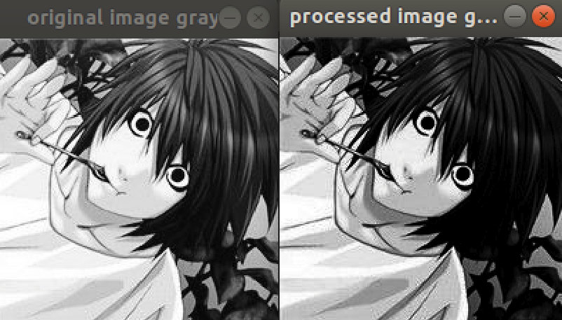

# OpenCL Example Code (Image Gamma Transform)

This is an example mini-project using OpenCL to conduct gamma transform of images.

**run the demo**

`bash run_all.sh` which compiles and runs the code (`gamma_transform.cpp`) with given arguments.

basic requirements: OpenCL/OpenCV/CMake, which can be installed via following commands:

```shell
sudo apt install -y g++ cmake make git libgtk2.0-dev pkg-config
git clone https://github.com/opencv/opencv.git
cd opencv
mkdir -p build && cd build
cmake ..
make -j4
sudo make install  ### default install path should be /usr/local/include/opencv4
````

**structure of the code**

```shell
├── CMakeLists.txt      // settings for cmake
├── custom_opencl_kernels.cl        // custom-defined kernel for opencl
├── gamma_transform.cpp         // main function for gamma transform the image
├── README.md
├── run_all.sh
└── sample_images
    └── Lawliet.jpg
```

**opencl kernel illustration**

```c++
__kernel void gamma_transform(__global uchar * img_src,
                              __global uchar * img_dst,
                              const int ncols,
                              __constant uchar * gamma_lut) {
    int i = get_global_id(0);
    int j = get_global_id(1);
    int index = i * ncols + j;  // get 2-dim index and calc mem offset
    uchar map_val = gamma_lut[img_src[index]];  // get remapped value using gamma LUT
    uchar min_val = 0;
    uchar max_val = 255;
    img_dst[index] = clamp(map_val, min_val, max_val);  // clamp to control the range
}
```

**test result**

Left: input image; right: gamma corrected image `(gamma = 2.2)`



